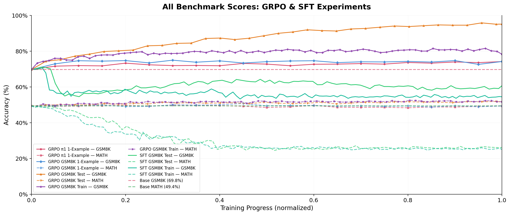
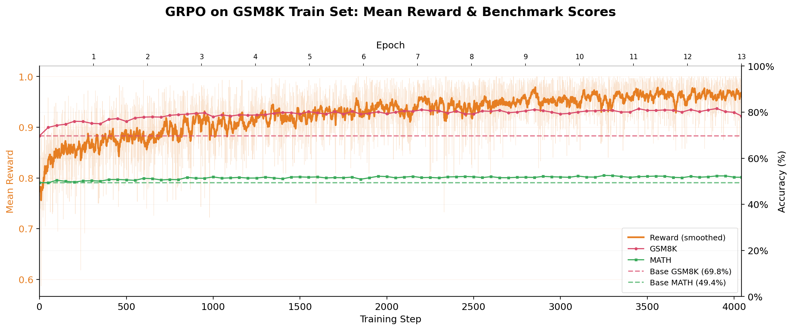
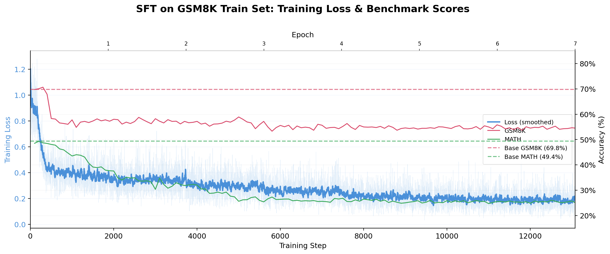
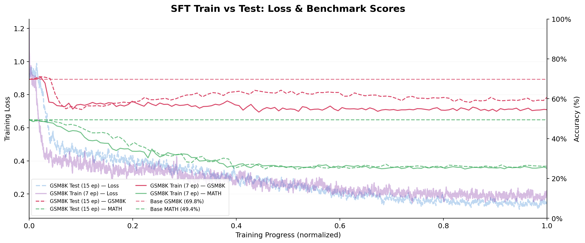
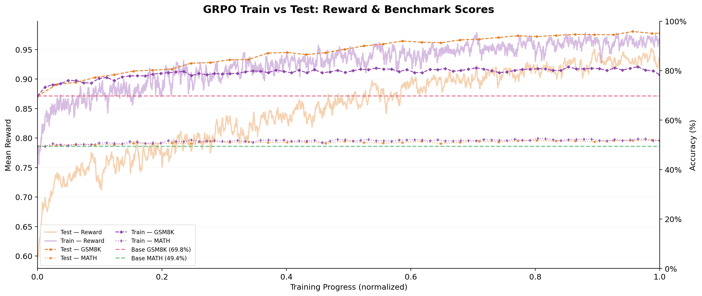
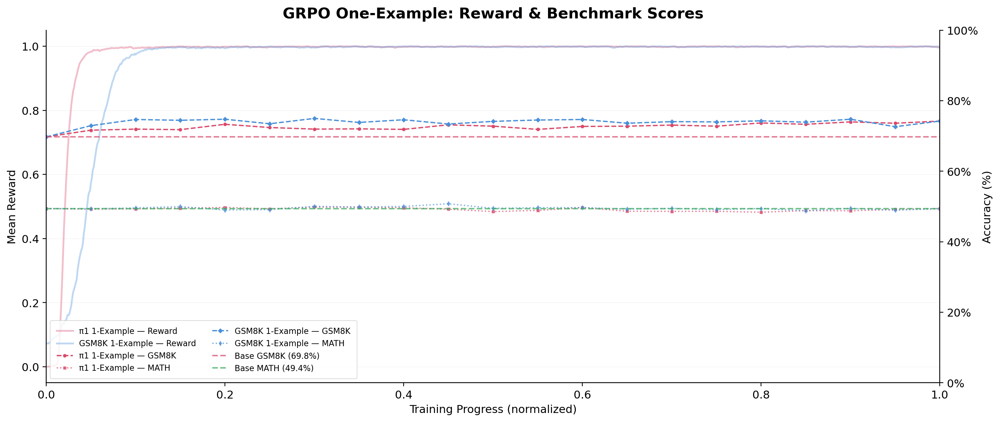
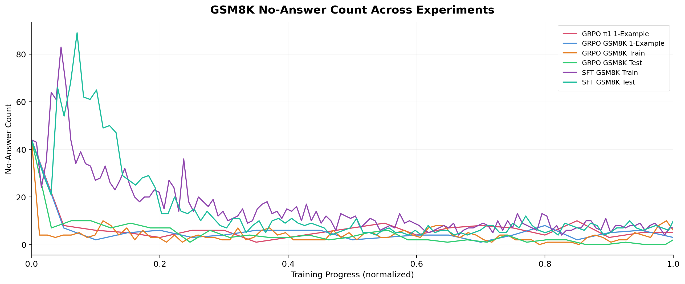
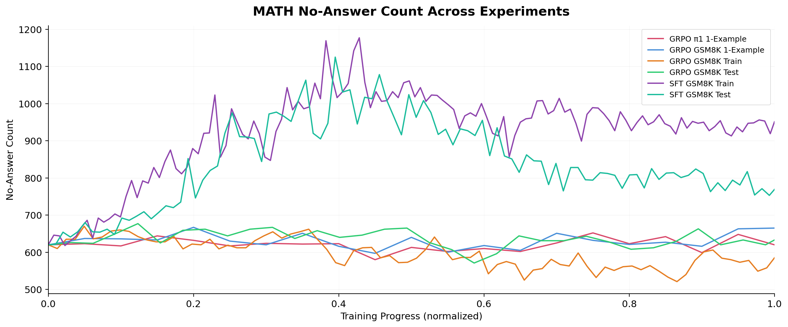
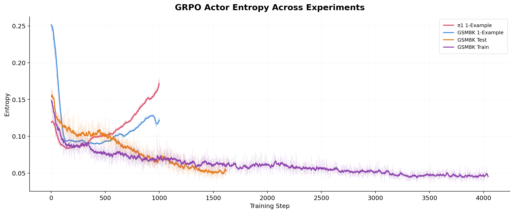
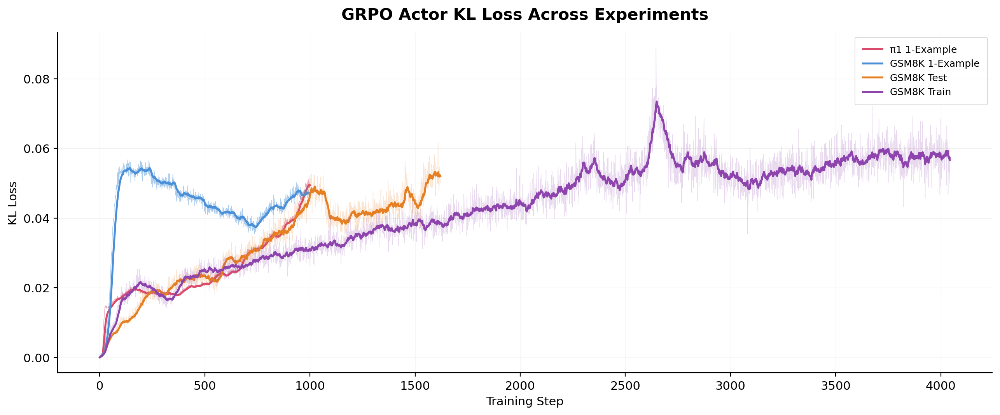

# RLVR vs SFT: Empirical Analysis on Qwen 2.5 1.5B

This repository presents the results of training Qwen 2.5 1.5B Instruct with SFT and RLVR (GRPO) on the GSM8K dataset, analyzing performance across GSM8K and MATH benchmarks.

👉 **[Browse full benchmark prompts and responses on Hugging Face Spaces](https://huggingface.co/spaces/jayminban/RLVR-vs-SFT-Qwen2.5-1.5b)**

👉 **[Download top-scoring model checkpoints on Hugging Face](https://huggingface.co/jayminban/RLVR-vs-SFT-Qwen2.5-1.5b-checkpoints)**

### Experiments

1. **RLVR vs SFT on GSM8K Train Split** — Comparing both training methods on the standard training data
2. **Cheating Analysis** — Training directly on the GSM8K test set to examine memorization vs generalization behavior between SFT and RLVR
3. **One-Example RLVR** — Inspired by [One-Shot-RLVR](https://github.com/ypwang61/One-Shot-RLVR), testing whether RLVR can improve reasoning from a single training example

### Why Qwen 2.5 1.5B?

Qwen 2.5 1.5B Instruct was chosen because it predates the introduction of RLVR by the DeepSeek team (DeepSeek-R1, January 2025). Released in September 2024 without any RLVR-aware training, it serves as a clean baseline for observing the effects of RLVR.

### Benchmark

All checkpoints were evaluated using my custom benchmark harness, **lm-eval-ledger**, with 0-shot prompting. The model generates chain-of-thought responses and the final answer is extracted from the first `\boxed{}` format and compared against ground truth.

0-shot was chosen because it produced the highest scores for the instruct model compared to few-shot settings. This was cross-validated against [lm-eval-harness](https://github.com/EleutherAI/lm-evaluation-harness), where 0-shot with my prompt template consistently outperformed all few-shot configurations evaluated with lm-eval-harness.

#### GSM8K Accuracy Across Evaluation Configurations (Qwen2.5-1.5B-Instruct)

| n-shot | lm-eval-harness | lm-eval-ledger (Chat Template) | lm-eval-ledger (No Chat Template, Qwen-Math2.5 few-shot) | lm-eval-ledger (No Chat Template, GSM8K train few-shot) |
|--------|-----------------|-------------------------------|-----------------------------------------------------|-------------------------------------------------------|
| 0      | 45.49           | **69.75**                     | 65.28                                               | 64.90                                                 |
| 1      | 52.24           | 64.29                         | 53.75                                               | 60.20                                                 |
| 2      | 55.34           | 61.94                         | 69.37                                               | 64.22                                                 |
| 3      | 55.34           | 63.31                         | 68.54                                               | 68.16                                                 |
| 4      | 56.63           | 63.99                         | 68.16                                               | 66.72                                                 |
| 5      | 56.48           | 61.18                         | 67.85                                               | 67.02                                                 |
| 6      | 57.24           | 63.00                         | 70.28                                               | 67.10                                                 |
| 7      | 56.25           | 56.63                         | **70.96**                                           | 65.13                                                 |
| 8      | 55.12               | 62.32                            | 69.14                                               | 67.70                                                 |

> **Reference:** The [Qwen2.5 technical report](https://arxiv.org/abs/2409.12122) reports **73.2%** on GSM8K for Qwen2.5-1.5B-Instruct (4-shot), though the exact evaluation setup is not fully specified.

Every prompt, model response, and extracted answer from all benchmarks in this project are logged to a SQLite database and can be explored on [Hugging Face Spaces](https://huggingface.co/spaces/jayminban/RLVR-vs-SFT-Qwen2.5-1.5b).

**lm-eval-ledger** with full SQLite logging will be released as a standalone project soon!

## Setup

All training was done using [verl](https://github.com/verl-project/verl). The training environment was built with [verlai/verl:vllm012.latest](https://hub.docker.com/layers/verlai/verl/vllm012.latest/images/sha256-9576682f85ca36f4ef719efccc5a5deb4d0b6f66f06fc14f43fdfed0749fbf5d) Dockerfile.

### RLVR (GRPO)

Loss consists of three terms:

$$\mathcal{L}_{\text{GRPO}} = \mathcal{L}_{\text{policy}} + \lambda_1 \mathcal{L}_{\text{KL}} + \lambda_2 \mathcal{L}_{\text{entropy}}$$

- $\lambda_1$ (low variance KL): 0.001
- $\lambda_2$ (entropy coefficient): 0.001
- Learning rate: 5e-7
- Weight decay: 0.01, gradient clipping: 1.0

Entropy loss was added to encourage exploration, taken from [One-Shot-RLVR](https://github.com/ypwang61/One-Shot-RLVR). 12 rollouts per prompt were generated with binary correctness reward only: 1 if the extracted answer matches ground truth, 0 otherwise. No format reward was used.

### SFT

Standard cross-entropy loss on GSM8K Socratic chain-of-thought responses.

- Learning rate: 5e-7, cosine schedule with 5% warmup
- Weight decay: 0.01, gradient clipping: 1.0

All reward functions, training scripts, and training data are available in this repository.

### Compute Resources
Compute used for all training runs and benchmarks presented in this project.
#### Training

| Experiment | GPUs | Duration | Steps | Epochs |
|---|---|---|---|---|
| GRPO GSM8K Train | 6× RTX 4090 | 32h 12m | 4043 | 13 |
| GRPO GSM8K Test | 8× RTX 3090 | 20h 09m | 1620 | 30 |
| GRPO GSM8K 1-Example | 8× RTX 3090 | 11h 16m | 1000 | — |
| GRPO DSR 1-Example | 8× RTX 3090 | 12h 43m | 1000 | — |
| SFT GSM8K Train | 1× RTX 5090 | 2h 46m | 13076 | 7 |
| SFT GSM8K Test | 1× RTX 5090 | 1h 06m | 4935 | 15 |

#### Benchmarking (1× RTX 5090)

| Experiment | Checkpoints | Tasks | Duration |
|---|---|---|---|
| GRPO GSM8K Train | 82 | GSM8K + MATH | 4h 13m |
| GRPO GSM8K Test | 34 | GSM8K + MATH | 1h 45m |
| SFT GSM8K Test + Train | 231 | GSM8K + MATH | 9h 37m |
| GRPO 1-Example (both) | 41 | GSM8K + MATH | 2h 06m |
| **Total** | **388** | — | **17h 41m** |

## Combined Results

All GRPO and SFT experiments plotted together. GRPO consistently improves or maintains performance, while SFT degrades on both test and train data.

| Method | Training Data | Steps | GSM8K (0-shot) | MATH (0-shot) |
|--------|--------------|-------|:--------------:|:-------------:|
| Qwen2.5-1.5B-Instruct (reproduced) | — | — | 69.7 | 49.2 |
| Qwen2.5-1.5B-Instruct (paper, 4-shot) | — | — | 73.2 | 55.2 |
| **GRPO**  | GSM8K train | 3,900 | **81.6(+11.9)** | 52.3 |
| **GRPO** | GSM8K test | 1,620 | 95.1(+25.4)* | 51.7 |
| **GRPO** | DSR 1 example | 1,000 | 74.2 | 49.4 |
| **GRPO**  | GSM8K 1 example | 1,000 | 74.2 | 49.4 |
| SFT | GSM8K train | 13,076 | 54.5 | 25.1 |
| SFT  | GSM8K test | 4,935 | 60.7* | 26.2 |

\* Trained on test data, not directly comparable.

All evaluations are 0-shot unless otherwise noted. For GRPO trained on the train set, the best checkpoint was selected based on primary benchmark (GSM8K) performance. For all other runs, final checkpoint performance is reported.

## RLVR vs SFT on GSM8K Train Split

**GRPO on GSM8K Train split:**

GRPO on the GSM8K train split shows steady improvement without overfitting. Reward increases consistently, and even the MATH score improves alongside it, suggesting gains in general reasoning ability rather than task-specific memorization.

**SFT on GSM8K Train split:**

SFT immediately degrades both GSM8K and MATH scores, with continued training making things worse even as train loss decreases. This suggests local optimization and overfitting rather than a generalized increase in reasoning ability. Notably, the no-answer rate decreases with SFT training. More on this in the No-Answer Analysis section.

## Cheating Analysis: RLVR vs SFT on GSM8K Test Split

To test whether models can cheat by memorizing answers, I tried trained directly on the GSM8K test set.

#### SFT on GSM8K Test Split

Similar to SFT on the train set, training immediately degrades both GSM8K and MATH performance scores. However, unlike the train set case, SFT on the test set shows a brief recovery in the middle phase before ultimately continuing to decline. This could suggest the model memorized some examples after the initial degradation, but couldn't generalize, failing to retain even the memorized test data itself.

#### GRPO on GSM8K Test Split

GRPO trained on the test set achieves near-perfect GSM8K accuracy, approaching 95%. This highlights a fundamental difference — rather than memorizing specific samples, GRPO reinforces the process of arriving at correct answers through its verifiable reward signal. MATH performance also rises from 49.2 to 51.7, similar to GRPO on the train set, suggesting that some general reasoning improvement has emerged.

## One-Example RLVR Analysis

**GRPO with single GSM8k and DSR π1 example:**

Inspired by the [One-Shot-RLVR](https://github.com/ypwang61/One-Shot-RLVR), I tested whether GRPO can learn from a single training example. Two experiments were conducted: one using the π1 problem suggested by the paper, and one using a single GSM8K question.

One examples are duplicated to fit the batch size of 24 and traind for 1000 steps. 

Training with a single example improves the GSM8K score from 69.7 to 74.2 (+4.5) while maintaining MATH at 49.2 to 49.4 (+0.2), suggesting general reasoning improvement has emerged, though not as much as training with the entire GSM8K train set. Both runs, despite using different examples, converge to the same performance after 1,000 steps. This convergence suggests that GRPO's improvement is driven by the reward signal itself rather than the specific training content.

## No-Answer Analysis

I tracked the number of samples where the model failed to produce an extractable answer (i.e., no \boxed{} output was found) across all checkpoints.

GSM8K: SFT models exhibit a sharp spike in no-answer count early in training, indicating initial format degradation. The no-answer rate then drops throughout training, but benchmark performance continues to degrade. This suggests the model has learned to produce surface-level correct formatting while its actual reasoning ability has deteriorated, resulting in confidently formatted but incorrect answers. GRPO models, by contrast, quickly lower no-answer counts and maintain consistently low rates throughout training.

MATH: The difference is more pronounced. SFT training causes a steady increase in no-answer count that never recovers to the degree seen in GSM8K, suggesting that the format compliance learned during SFT does not generalize to harder problems. GRPO models maintain stable no-answer rates across both benchmarks, indicating that the reward signal encourages both correct formatting and correct reasoning simultaneously.

## Training Dynamics

Entropy and KL divergence across all GRPO experiments. Entropy trends show how the model's output distribution evolves during training, while KL divergence tracks how far the model has shifted from its initial behavior.

## Conclusion
SFT immediately degrades reasoning ability across both benchmarks, exhibiting catastrophic forgetting even while train loss decreases. The model learns surface-level formatting at the cost of general reasoning, producing confidently structured but incorrect answers.

GRPO consistently improves general reasoning ability across all data conditions, from full datasets to a single example, without the catastrophic forgetting seen in SFT. The verifiable reward signal reinforces generalizable reasoning rather than surface-level pattern matching. Even with a single training example, GRPO elicits meaningful improvement, and both one-example runs converge to identical performance regardless of the example used, suggesting the reward signal activates latent reasoning capability rather than memorizing task-specific knowledge.

